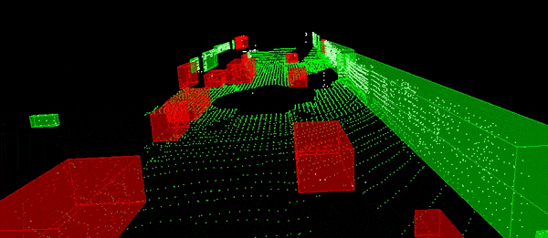
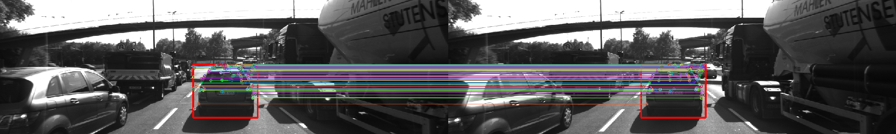
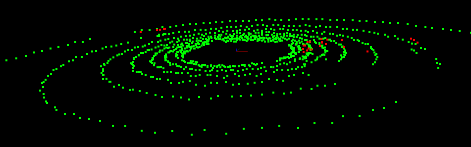

# Towards Autonomy Perception Library (TAPL)

Goal of this library is to provide an easy and quick way of implementing several well known algorithms like Visual Odometry, Visual SLAM, RANSAC, PnP, Bundle Adjustment etc.

## Prerequisites  

 - OpenCV >= 4.1
 - PCL >= 1.2

## Examples of Perception Task  

#### Visual Odometry for a sequence of Monocular camera images  

 - All the API has been provided in *src/cvEngine.cpp*. See usage in *examples/monoVO.cpp* 

#### Visual Odometry for a sequence of Stereo camera images  

 - Under development  

#### Euclidean Clustering within a point-cloud using kd-tree for storing points.  

 - C++ implementation of kd-tree and euclidean clustering in *src/ptEngine.cpp*  

#### Image Feature Detection and Tracking  

 - C++ implementation in *src/cvEngine.cpp*  

#### RANSAC for line and plane fitting  

 - C++ implementation of RANSAC for line and plane fitting using both SVD and least-square methods are provided in *cve/ptEngine.cpp* which can be simply used as an API.  

  
   

TODO Notes:

 - one header file 'tapl.h' at the parent location which includes everythin under 'include/'. This should be the only file that needs to be included by any other code.  
 - modify the data structure *DataFrame* to use new *structs* *CameraFrame*. Another struct *StereoCamFrame*  uses two instances of it for left and right camera frames. 
 - For each data, use a boolean flag to specify if it exists.  
 - Use a struct constructor to initialize the struct and set false flags.  
  
