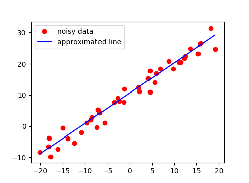

# Towards Autonomy Perception Library (TAPL)

Goal of this library is to provide an easy and quick way of implementing perception pipelines. 


## [**Find on GitHub**](https://github.com/towardsautonomy/TAPL)

## Examples of Perception Task  

#### Visual Odometry for a sequence of Monocular camera images  

 - All the API has been provided in *src/cvEngine.cpp*. See usage in *examples/monoVO.cpp* 


#### Visual Odometry for a sequence of Stereo camera images  

 - Under development  

#### Euclidean Clustering within a point-cloud using kd-tree for storing points.  

 - C++ implementation of RANSAC for ground segmentation, kd-tree and euclidean clustering in *src/ptEngine.cpp*  


#### Image Feature Detection and Tracking  

 - C++ implementation in *src/cvEngine.cpp*  


#### RANSAC for line and plane fitting  

 - C++ implementation of RANSAC for line and plane fitting using both SVD and least-square methods are provided in *cve/ptEngine.cpp* which can be simply used as an API.  

<!-- <p float="left">
  
   
</p> -->

Line Fitting using RANSAC     |  Plane Fitting using RANSAC
:----------------------------:|:-------------------------:
  |  
  
## Prerequisites  

 - CMake >= 3.5
 - OpenCV >= 4.1
 - PCL >= 1.2

 ## Installation Instructions  

 - Download the library.  

   ```
   git clone https://github.com/towardsautonomy/TAPL.git
   ```

 - Build and install the library as follows.  
 
   ```
   mkdir build  
   cd build
   cmake ..
   make
   sudo make install
   ```

 - Build the examples as follows.  

   ```
   cd examples
   mkdir build
   cd build
   cmake ..
   make
   ```