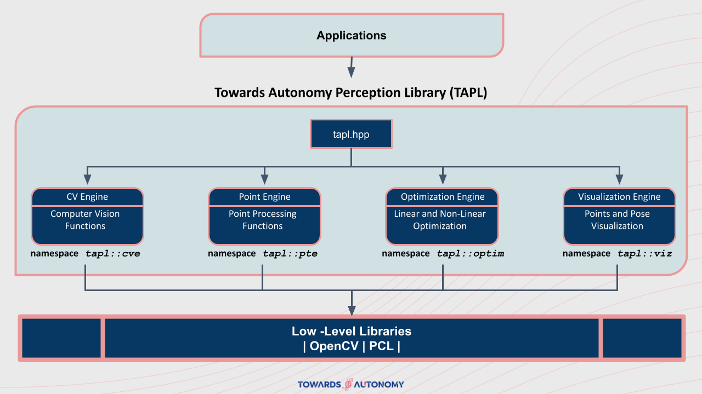
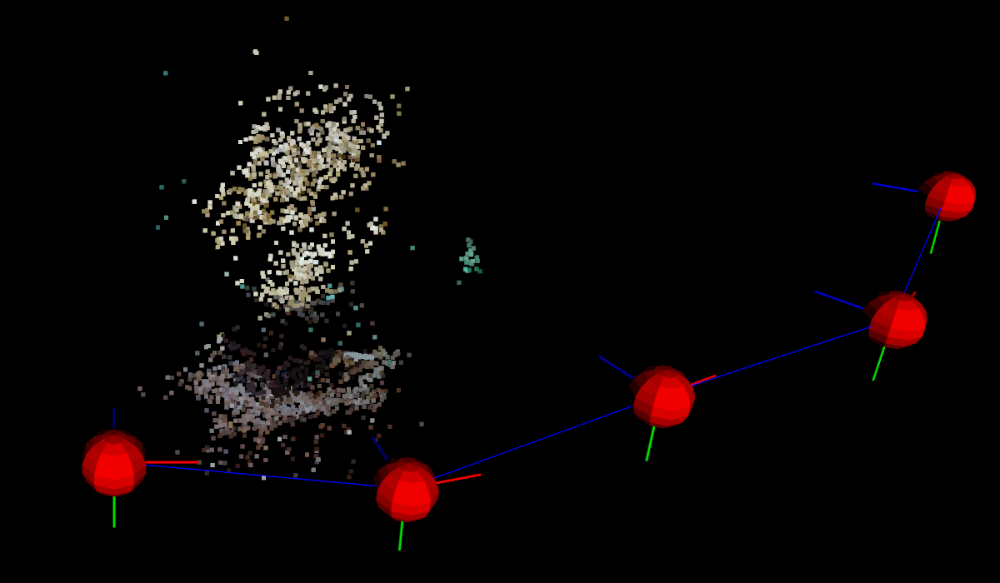

# Towards Autonomy Perception Library (TAPL)

The goal of this library is to provide an open-source platform for perception algorithm pipelines. It provides methods for several computer vision algorithms such as Structure from Motion (SfM), Camera Calibration from a single image, Visual Odometry, Bundle Adjustment, Feature Detection and Tracking, Panoramic Image Stitching, etc. TAPL also provides methods for point-based processing such as KD tree implementation, Euclidian Clustering, Plane Fitting, and so on.  



## [**Library Home (GitHub)**](https://github.com/towardsautonomy/TAPL)

### Structure-from-Motion

Structure from Motion (SfM) is inspired by our ability to learn about the 3D structure in the surrounding environment by moving through it. Given a sequence of images, we are able to simultaneously estimate both the 3D structure and the path the camera took.

SfM can be solved using either Factorization Method or Algebraic Method. Some of the drawbacks of the Factorization Method are: (1) It assumes that the 3D points are visible in all cameras. (2) It assumes Affine Cameras and therefore, there exists affine ambiguity in the solution in addition to similarity ambiguity.

In Algebraic Method, we assume a projective camera and then solve for camera poses and 3D points using non-linear optimization for bundle adjustment. We first compute Essential Matrix and then use it to find out 4 possible pairs of R,T for each pair of cameras. For each pair of R,T, we then compute the linear estimate of 3D points which is further refined using bundle adjustment for minimizing reprojection errors between pairwise cameras with non-linear optimization method (Gauss-Newton). These 3D points can further be used to filter the best R,T, by enforcing the criteria that all the points should be ahead of camera planes.

We also provide an implementation of Gauss-Newton Optimization for reprojection loss minimization during bundle adjustment, which is used in the SFM pipeline for 3D point estimation.



#### LiDAR Object Detection  

This example is provided at ```examples/src/lidarObjectDetection.cpp```. It reads in PCD point-cloud files, performs downsampling, ground-plane segmentation, and clustering, and then some post-processing filtering to get 3D Bounding-Box of objects.  

**Pipeline**  

  - Load point-cloud data.  
  - Downsample point-cloud (voxelization).  
  - Crop the point-cloud based on a region of interest.  
  - Segment out ground-plane using RANSAC.  
    - For *n* iterations:  
      - Choose 3 random points.  
      - Fit a plane using least-squares.  
      - Count number of inliers within a certain distance threshold between each point and plane.  
    - Choose the plane that resulted in maximum number of inliers.  
    - Implemented as part of ```class tapl::pte::Plane()```.  
  - Perform Euclidian Clustering within the segmented point-cloud.  
    - Store the point-cloud as a **KdTree**. Implemented as ```struct tapl::pte::KdTree```.  
    - Perform euclidean clustering on the KdTree. Implemented as ```class tapl::pte::EuclideanCluster()```.  
  - Filter and Extract the bounding-boxes.  
  
  

  

#### Panaromic Image Stitching

This example is provided at ```examples/src/panoramicStitching.cpp``` and this functionality is implemented as ```tapl::cve::stitchPanaromic()```.  


#### Image Feature Detection and Tracking  

This example is provided at ```examples/src/kptsDetectionAndTracking.cpp``` and this functionality is implemented as ```tapl::cve::detectAndMatchKpts()```.


#### RANSAC for line and plane fitting  

 - C++ implementation of RANSAC for line and plane fitting using both SVD and least-square methods are provided as part of ```class tapl::pte::Line()``` and ```class tapl::pte::Plane()```.  

<!-- <p float="left">
  
   
</p> -->

Line Fitting using RANSAC     |  Plane Fitting using RANSAC
:----------------------------:|:-------------------------:
  |  
  
## Prerequisites  

 - CMake >= 3.5
 - OpenCV >= 4.1
 - PCL >= 1.2  
 - Eigen >= 3.2

 ## Installation Instructions  

 - Download the library.  

   ```
   git clone https://github.com/towardsautonomy/TAPL.git
   ```

 - Build and install the library as follows.  
 
   ```
   mkdir build  
   cd build
   cmake ..
   make
   sudo make install
   ```

 - Build the examples as follows.  

   ```
   cd examples
   mkdir build
   cd build
   cmake ..
   make
   ```

## Contributions

TAPL is a free open source platform. Any contribution to this platform is welcome and appreciated.